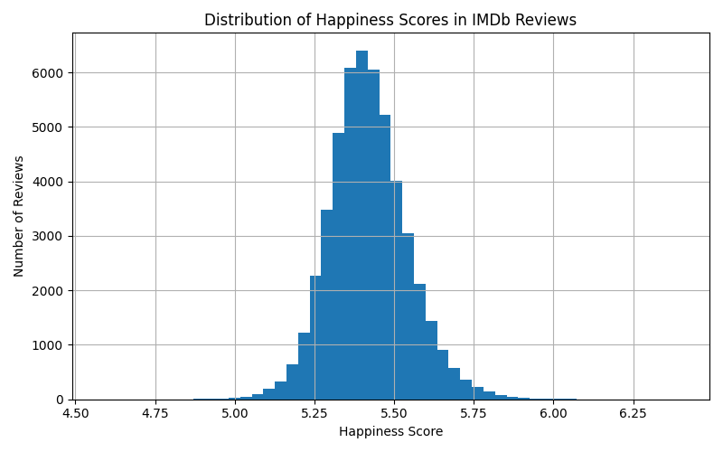
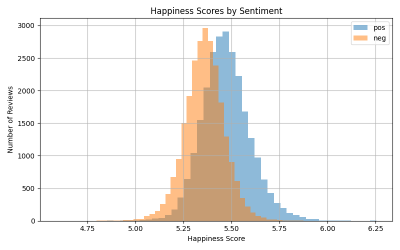

# Mini-Project 2: Inferring Happiness Dynamics in Media

## 1. Project Overview

This project applies the **labMT hedonometer lexicon** to a corpus of movie reviews to measure emotional content in text. The goal is to estimate happiness scores for documents and examine how these scores relate to sentiment and rating.

We use the **IMDb Large Movie Review Dataset**, which contains 50,000 movie reviews labeled as positive or negative. By applying the hedonometer method to this dataset, we explore whether language associated with positive reviews produces higher happiness scores than language in negative reviews.

## 2. Repository Structure

repo/
│
├── README.md  
├── requirements.txt  
│  
├── src/  
│   ├── clean_imdb.py  
│   ├── hedonometer_scoring.py  
│   └── analysis_plots.py  
│  
├── data/  
│   ├── raw/  
│   │   └── imdb/  
│   │       ├── train/  
│   │       └── test/  
│   │  
│   └── processed/  
│       └── imdb_reviews_clean.csv  
│  
├── figures/  
│  
└── tables/  

Raw datasets are stored in `data/raw/`, while cleaned datasets used for analysis are stored in `data/processed/`.

## 3. Dataset

### IMDb Large Movie Review Dataset

The IMDb Large Movie Review Dataset contains **50,000 movie reviews** collected from IMDb.

Dataset characteristics:

- 25,000 training reviews
- 25,000 test reviews
- Balanced sentiment labels
- Positive reviews: rating ≥ 7
- Negative reviews: rating ≤ 4
- Neutral reviews are excluded

The dataset is distributed as individual text files organized into directories.

Dataset folder structure:

train/  
&nbsp;&nbsp;&nbsp;&nbsp;pos/  
&nbsp;&nbsp;&nbsp;&nbsp;neg/  

test/  
&nbsp;&nbsp;&nbsp;&nbsp;pos/  
&nbsp;&nbsp;&nbsp;&nbsp;neg/  

Each review file follows the naming convention:

[id]_[rating].txt

Example:

200_8.txt

This file corresponds to:
- review ID: 200
- rating: 8/10

Sample:

- random sampling to limit bias
- fixed seed for reproducibility
- 200 reviews total : 50 pos reviews in train, 50 neg reviews in train, 50 pos reviews in test, 50 neg reviews in test
- to avoid a sample majorly positive or negative, we balanced positive and negative reviews 
- for a more representative sample, we balanced train and test
- Sanity checks: first few rows + counts
- Distribution checks: statistics and histograms of happiness score + of happiness score by sentiment : the sample reflects the dataset's distributions
- mean : 5.4325
- std : 0.1248
- min : 4.9130 
- max : 5.8932
- 25% : 5.3501
- 50% : 5.4250
- 75% : 5.5037

## 4. Data Processing

To make the dataset usable for analysis, we convert the individual text files into a structured dataset.

Processing script:

src/clean_imdb.py

This script performs the following steps:

1. Iterates through the dataset directory structure (`train/test`, `pos/neg`)
2. Extracts metadata from filenames
3. Reads review text from each file
4. Stores the information in a pandas DataFrame
5. Saves the dataset as a single CSV file

The processed dataset contains one row per review.

Example dataset structure:

| review_id | rating | sentiment | split | text |
|-----------|--------|----------|-------|------|
| 200 | 8 | pos | test | this movie was amazing... |

The final dataset is saved as:

data/processed/imdb_reviews_clean.csv

Basic preprocessing steps include:

- removing newline characters
- trimming extra whitespace
- converting text to lowercase

## 5. Estimand

- the estimand is the difference in mean happiness scores between positive and negative reviews
- population quantity: difference in mean sentiment between positive (rating ≥ 7) and negative reviews (rating ≤ 4)
- unit of analysis: individual IMDB review

## 6. Methods

We apply the **hedonometer method** using the labMT lexicon.

Steps:

1. Tokenize each review into words
2. Match tokens with words in the labMT lexicon. We will check which tokens from each review are present in the lexicon dictionary we made. 
3. For each token that exists in the lexicon, we retrieve its happiness score. 
4. Make a histograpm showing the distribution of happiness scores across all reviews. 
5. Make another plot comparing happiness scores for positive vs. negative reviews. 
6. Compute the average happiness score for each review

This produces a document-level happiness estimate for each review.

## 7. Analysis
The mean happiness scores are slightly above the midpoint where labMT scores range roughly from 1 to 9, with 5 as neutral.

# 8. Baseline descriptive comparison

- we compared the mean happiness score for positive and negative reviews in the sample
- mean happiness positive reviews: 5.49
- mean happiness negative reviews: 5.37
- baseline point estimate of the difference between positive and negative reviews: 0.12
- positive reviews thus present a slightly higher happiness score

## 9. Visualizations

### Distribution of Happiness Scores

This histogram shows the distribution of happiness scores across all IMDb reviews. Most reviews cluster around the middle range, with both ends of positive and negative tapering into extreme responses of sentiment. This helps us see the overall emotional positive and negative sentiments in the dataset.

### Happiness Scores by Sentiment

This plot compares happiness scores for positive and negative reviews. Positive reviews tend to have higher happiness scores, while negative reviews cluster at lower scores. This demonstrates that the hedonometer method was a good option with modeling the sentiments in the IMDb dataset. 

## 10. How to Run the Code

## 11. Tools Used

- Python  
- pandas  
- numpy  
- matplotlib  
- GitHub for version control  

AI assistance was used to help debug code and clarify programming concepts.

## 12. Credits

Team members and roles:

- Repo & workflow lead:  
- Data acquisition lead:  
- Measurement lead:
- Stats and sampling lead: Marguerite Audeguis
- Visualization lead:  

## 13. References

Maas, A. L., Daly, R. E., Pham, P. T., Huang, D., Ng, A. Y., & Potts, C. (2011).  
Learning Word Vectors for Sentiment Analysis. Proceedings of ACL 2011.

Dodds, P. S., et al. (2011).  
Temporal patterns of happiness and information in a global social network.