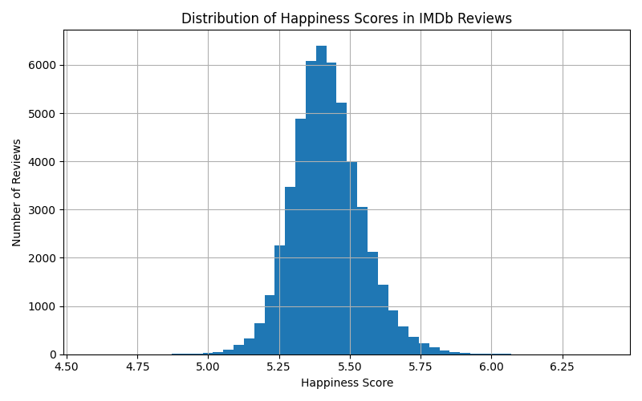
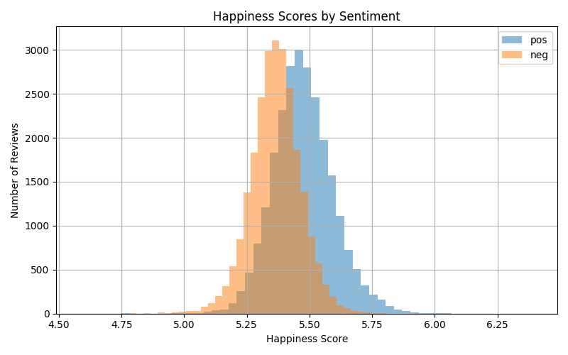
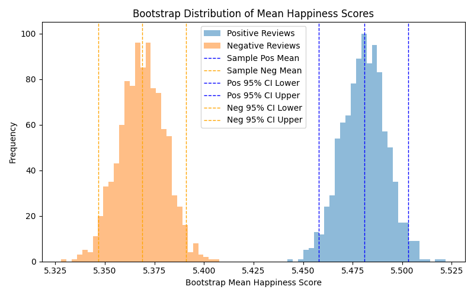
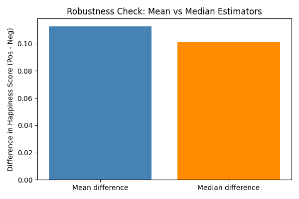

# Mini-Project 2: Inferring Happiness Dynamics in Media

## 1. RQ, Claim, and Project Overview

### Research Question

How accurately do hedonometer happiness scores capture the sentiment expressed in IMDb movie reviews, and to what extent do positive reviews yield higher happiness scores than negative reviews?

### Claim

Hedonometer happiness scores effectively capture sentiment differences in IMDb movie reviews, as positive reviews consistently produce higher happiness scores than negative reviews across the dataset. This pattern holds across a large sample of reviews and reflects the presence of more positively valenced language in positive reviews, indicating that the hedonometer provides a reliable approximation of emotional tone in this context.

### Project overview

This project applies the **labMT hedonometer lexicon** to a corpus of movie reviews to measure emotional content in text. The goal is to estimate happiness scores for documents and examine how these scores relate to sentiment and rating.

We use the **IMDb Large Movie Review Dataset**, which contains 50,000 movie reviews labeled as positive or negative. By applying the hedonometer method to this dataset, we explore whether language associated with positive reviews produces higher happiness scores than language in negative reviews.

## 2. Dataset 

### IMDb Large Movie Review Dataset

The IMDb Large Movie Review Dataset contains **50,000 movie reviews** collected from IMDb.

Dataset characteristics:

- 25,000 training reviews
- 25,000 test reviews
- Balanced sentiment labels
- Positive reviews: rating ≥ 7
- Negative reviews: rating ≤ 4
- Neutral reviews are excluded

The dataset is distributed as individual text files organized into directories.

Dataset folder structure:

train/  
&nbsp;&nbsp;&nbsp;&nbsp;pos/  
&nbsp;&nbsp;&nbsp;&nbsp;neg/  

test/  
&nbsp;&nbsp;&nbsp;&nbsp;pos/  
&nbsp;&nbsp;&nbsp;&nbsp;neg/  

Each review file follows the naming convention:

[id]_[rating].txt

Example:

200_8.txt

This file corresponds to:
- review ID: 200
- rating: 8/10

Sample:

- random sampling to limit bias
- fixed seed for reproducibility
- 200 reviews total : 50 pos reviews in train, 50 neg reviews in train, 50 pos reviews in test, 50 neg reviews in test
- to avoid a sample majorly positive or negative, we balanced positive and negative reviews 
- for a more representative sample, we balanced train and test
- Sanity checks: first few rows + counts
- Distribution checks: statistics and histograms of happiness score + of happiness score by sentiment : the sample reflects the dataset's distributions
- mean : 5.4325
- std : 0.1248
- min : 4.9130 
- max : 5.8932
- 25% : 5.3501
- 50% : 5.4250
- 75% : 5.5037

### labMT 1.0 Lexicon

The labMT 1.0 dataset (Dodds et al., 2011) is a lexicon of commonly used English words, each assigned a happiness score on a scale from 1 (least happy) to 9 (most happy). The words were selected from large text corpora, including Twitter, Google Books, New York Times articles, and music lyrics, and were rated by human annotators using Amazon Mechanical Turk.

The dataset is designed to measure the average emotional tone of text by matching words in a document to the lexicon and averaging their associated happiness scores. In this project, the labMT lexicon is used as a measurement tool to compute document-level happiness scores for IMDb movie reviews, enabling comparison of emotional tone across positive and negative sentiment categories.

## 3. Ethical considerations 

Several ethical considerations arise when working with both the lexicon and the review dataset.

First, the labMT lexicon reflects cultural assumptions embedded in the crowd-sourced ratings used to construct it. Word meanings and emotional associations may vary across communities, cultures, and contexts. As a result, the happiness scores produced by the lexicon should be interpreted as **approximate indicators of emotional tone rather than objective measurements**.

Second, lexicon-based approaches do not account for linguistic context. Words may carry different emotional meanings depending on how they are used in a sentence. Sarcasm, irony, and complex narrative structures can therefore produce misleading scores.

Third, the IMDb dataset consists of publicly available user-generated reviews. Although these texts are publicly accessible, they still represent the expressions of individual users. Analyses of such data should therefore be conducted responsibly and interpreted cautiously.

Finally, the dataset intentionally excludes neutral reviews, which may exaggerate differences between positive and negative categories. This design choice simplifies classification but may not fully represent the spectrum of opinions expressed in real-world review data.

## 4. Data Processing

To make the dataset usable for analysis, we convert the individual text files into a structured dataset.

Processing script:

src/clean_imdb.py

This script performs the following steps:

1. Iterates through the dataset directory structure (`train/test`, `pos/neg`)
2. Extracts metadata from filenames
3. Reads review text from each file
4. Stores the information in a pandas DataFrame
5. Saves the dataset as a single CSV file

The processed dataset contains one row per review.

Example dataset structure:

| review_id | rating | sentiment | split | text |
|-----------|--------|----------|-------|------|
| 200 | 8 | pos | test | this movie was amazing... |

The final dataset is saved as:

data/processed/imdb_reviews_clean.csv

Basic preprocessing steps include:

- removing newline characters
- trimming extra whitespace
- converting text to lowercase

## 5. Estimand

- the estimand is the difference in mean happiness scores between positive and negative reviews
- population quantity: difference in mean sentiment between positive (rating ≥ 7) and negative reviews (rating ≤ 4)
- unit of analysis: individual IMDB review

## 6. Methods

We apply the **hedonometer method** using the labMT lexicon.

Steps:

1. Tokenize each review into words
2. Match tokens with words in the labMT lexicon. We will check which tokens from each review are present in the lexicon dictionary we made. 
3. For each token that exists in the lexicon, we retrieve its happiness score. 
4. Make a histograpm showing the distribution of happiness scores across all reviews. 
5. Make another plot comparing happiness scores for positive vs. negative reviews. 
6. Compute the average happiness score for each review

This produces a document-level happiness estimate for each review.

### Handling Out-Of-Vocabulary (OOV) Words
Tokens in the IMDb review that do not appear in the labMT lexicon are considered OOV. They are not included in the hedonometer scoring.

We collected all OOV words and saved them to a file ([tables/oov_words.csv](tables/oov_words.csv)). For happiness scoring, we ignored OOV words and only used tokens with labMT scores. This ensures our results are based on validated lexicon data

## 7. Analysis
The mean happiness scores are slightly above the midpoint where labMT scores range roughly from 1 to 9, with 5 as neutral.

### 7.1 Baseline descriptive comparison

- we compared the mean happiness score for positive and negative reviews in the sample
- mean happiness positive reviews: 5.49
- mean happiness negative reviews: 5.37
- baseline point estimate of the difference between positive and negative reviews: 0.12
- positive reviews thus present a slightly higher happiness score

### 7.2 Quantifying uncertainty

assumptions:
- resampling unit: individual IMDB review
- independence: reviews are assumed independent
- representativeness: the sample is balanced and reflects the dataset distributions

method:
- we used bootstrap resampling to quantify uncertainty for the average happiness score of both positive and negative reviews and for the baseline point estimate
- we resampled both positive and negative reviews with replacement 1000 times
- for each resample, we computed the mean happiness score
- we calculated the difference in means (positive - negative) for each bootstrap iteration 
- we calculated the 95% percentile confidence intervals for each group mean and the difference

results:
- 95% confidence interval for positive reviews: [5.47, 5.51]
- 95% confidence interval for negative reviews: [5.35, 5.40]
- 95% confidence interval for the difference in means (pos - neg): [0.09, 0.15]
- this confirms that positive reviews have a higher mean happiness score

To quantify our confidence in this effect, we estimated the probability that positive reviews have higher happiness scores than negative reviews: 
- probability: 1.00
- in all bootstrap iterations, positive reviews are happier than negative reviews
- this strongly supports our claim

## 8. Visualizations

### Distribution of Happiness Scores


This histogram shows the distribution of happiness scores across all IMDb reviews. Most reviews cluster around the middle range, with both ends of positive and negative tapering into extreme responses of sentiment. This helps us see the overall emotional positive and negative sentiments in the dataset.

### Happiness Scores by Sentiment


This plot compares happiness scores for positive and negative reviews. Positive reviews tend to have higher happiness scores, while negative reviews cluster at lower scores. This demonstrates that the hedonometer method was a good option with modeling the sentiments in the IMDb dataset. 

### Bootstrap Distribution by Sentiment 


This histogram shows the bootstrap distribution of the difference in mean happiness scores (positive − negative) across 1,000 resamples. The observed mean difference (black dashed vertical line, 0.12) sits well above zero (red dashed vertical line), and the entire 95% CI [0.09, 0.15] (blue and green dashed vertical lines) lies above zero. This confirms that positive reviews consistently score higher than negative reviews, and the difference is unlikely to be due to chance.

### Bootstrap Distribution of Mean Happiness Scores


This plot shows the bootstrap distributions of mean happiness scores for positive (blue) and negative (orange) reviews across 1,000 resamples. The two distributions are completely separate with no overlap, and the 95% confidence intervals (shown by vertical dashed lines) do not intersect. Positive reviews consistently score higher (CI: [5.47, 5.51]) than negative reviews (CI: [5.35, 5.40]), which strongly supports our claim that sentiment label is associated with a meaningful difference in happiness score.

### Robustness 


To test whether our findings depend on the estimator used to summarize
review happiness, we compared the mean and median happiness scores
for positive and negative reviews. The difference between positive and
negative reviews remained visible when using the median estimator,
indicating that the result is not driven by a small number of extreme
outliers.

We also examined mean absolute error (MAE) and mean squared error (MSE)
relative to the corpus mean. Because MSE penalizes larger deviations more
heavily than MAE, this comparison helps illustrate how sensitive our
estimates are to extreme values. The consistency across estimators
suggests that the observed difference reflects a general pattern in
review language rather than a few unusually positive or negative tokens.

## 9. Word Exhibit: Timing and Emotional Expression

Words in our exhibit were chosen if they contained timing phrases to explore how variables such as immediacy of a sentiment or delay shapes reviewer's emotional and analytical language. Reviews written immediately after viewing often use affective words (e.g., “enchanted,” “mesmerised”), while those written days or weeks later tend to be more reflective or critical. This analysis suggests how timing of the posted review, retrospective memory, and context influence public expressions of sentiment in the digital film culture.

**Why did we pick these 6 words?**
They are sentiment words that reflect cultural context in correlation to timing phrases. We check on certain phrases such as "immediate" or "a week later" related to the sentiment (positive or negative) of the reviews. We also notice the language use being shaped by how immediate the review was made, such as using more emotionally nuanced words or more analytical words. The timing phrases tell us when the post was made in relation to watching, the sentiment, the review snippet, and the cultural/contextual note are notes about the review in relation to the timing phrases. The ones reading more analytical may have patterns of more reflection.

This table captures the timing of when certain words related to the sentiment of the reviews were used in the reviews. The timing phrases tell us when the post was made in relation to watching, the sentiment, the review snippet, and the cultural/contextual note are notes about the review in relation to the timing phrases.

| Word        | Timing Phrase         | Sentiment   | Review Snippet            | Cultural/Contextual Note                |
|------------|----------------------|------------|---------------------------|-----------------------------------------|
| enchanted  | first saw            | Positive   | I first saw this film when I was about seven years old and was completely enchanted by it then… | Nostalgia, childhood memory             |
| disappointed| a week later        | Negative   | now i am twenty one and stumbled upon the film by accident about two weeks ago… | Reflective, delayed reaction            |
| mesmerised | immediately          | Positive   | damn, was that a lot to take in. i was pretty much mesmerised throughout…      | Immediate, strong emotional response    |
| enjoyed    | when it was in theaters | Positive | i read many commits when it was in the theaters and they were all bad....i think you have to be a certain type of person to enjoy these movies. | Social context, collective experience   |
| critical   | 14 hours later        | Analytical | 14 hours later i am still trying to find flaws in the plot but i cannot think of anything serious. | Analytical, delayed reflection

## 10. How to run the code 
### 1. Clone the Repository

```bash
git clone <repository-url>
cd qualitative-quantitative-group2-main
```

### 2. Install Dependencies

The project requires a small set of Python libraries. Install them using the provided `requirements.txt`.

```bash
pip install -r requirements.txt
```

Required packages:

* pandas
* numpy
* matplotlib

Python 3.8 or newer is recommended.

### 3. Verify Dataset Location

The code expects the IMDb dataset to already be included in the following directory:

```
data/IMDb/raw/imdb/
```

Inside this directory the structure should look like:

```
imdb/
├── train/
│   ├── pos/
│   └── neg/
└── test/
    ├── pos/
    └── neg/
```

Each `.txt` file represents a single review. The filename encodes metadata in the format:

```
[id]_[rating].txt
```

Example:

```
200_8.txt
```

* `200` → review ID
* `8` → star rating (1–10)

### 4. Run the Data Processing Script

Execute the main script from the project root:

```bash
python src/code_file.py
```

### 5. Output

The script will:

1. Traverse all review files in the IMDb dataset.
2. Extract metadata from filenames.
3. Combine the dataset into a structured table.

The final cleaned dataset will be saved to:

```
data/processed/imdb_reviews_clean.csv
```

Each row in the output CSV represents one review with the following columns:

* `review_id` – extracted from the filename
* `rating` – numerical rating (1–10)
* `sentiment` – positive or negative label
* `split` – train or test
* `text` – full review text

## 11. Tools Used

- Python  
- pandas  
- numpy  
- matplotlib  
- GitHub for version control  

AI assistance was used to help debug code and clarify programming concepts.

## 12. Credits

- Who did what (team roles)
	- Anastasia Ciorogaru: Repo & Workflow Lead & Figure + Data Aqcuisition Lead
		- created and organized the repository, cleaned up code and README, managed branches and helped stay organized
		- additionally, wrote the code for dataset cleanup (loaded dataset, handled missing values, converted data types)
    	- wrote the code and interpretation for the robustness check, wrote the ethical considerations regarding dataset and detailed provenance and data structure
        - reconfigured repository when needed 
	- Catalina Mena Llopez: Qualitative / Close Reading + Measurement Lead
		- lead interpretation of selected words, performed sanity checks, helped with distribution of happiness scores
		- connected qualitative observations back to patterns in the plots
		- created citation list
		- implemented and tested hedonometer scoring (tokenization, matching to labMT , handling OOV words), word exhibit choice in words based on timing phrases, and summary statistics
	- Yoonkyung Kim: Provenance & Critique Lead
		- reconstructed the dataset pipeline
		- wrote the 'critical reflection' sections: consequence, bias, limitations, and what the dataset makes easy/hard to see. 
	- Marguerite Audeguis: Quantitative Analyst + Stats and Sampling Lead
		- led descriptive statistics, and created plots
		- checked results for sanity and reproducibility
		- additionally wrote code and interpretation for corpus comparison, and wrote the project overview
		- (sampling plan (code, histograms and readme), quantifying uncertainty (code, histograms and some analysis))
	- Hena Puthengot : Data Processing & Implementation
       - prepared and structured IMDb review dataset for analysis
       - handled data loading and preprocessing for compatibility with labMT lexicon
       - cleaned and tokenized review text for sentiment analysis
       - supported hedonometer implementation by preparing input data
      

## 13. References

Maas, A. L., Daly, R. E., Pham, P. T., Huang, D., Ng, A. Y., & Potts, C. (2011).  
Learning Word Vectors for Sentiment Analysis. Proceedings of ACL 2011.

Dodds, P. S., et al. (2011).  
Temporal patterns of happiness and information in a global social network.

Hedonometer. "About." https://hedonometer.org/about.html

GitHub Copilot. "GitHub Copilot." GitHub. https://github.com/features/copilot.
